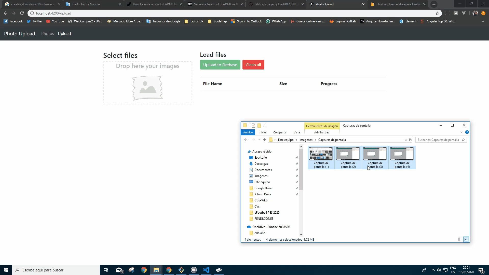

# ImageUpload

This project was generated with [Angular CLI](https://github.com/angular/angular-cli) version 8.3.22.
This project is about upload multiple images simultaneously to Firebase. The loading is made by dropping the files in a square area.
Once the images are uploaded, we can see them listed.

## Motivation

The goal of this project is to reforce angular knowledges and apply new concepts.
Project is based on Fernando Herrera's course [https://www.udemy.com/course/angular-2-fernando-herrera/] with own improvements.

## Libraries

Project is created with:
* Bootstrap 4.4.1
* Firebase 7.6.2

## Screenshots



## Installation
To run this project, install it locally using npm:

```
$ npm install
$ ng serve
```

## Development server

Run `ng serve` for a dev server. Navigate to `http://localhost:4200/`. The app will automatically reload if you change any of the source files.

## Build

Run `ng build` to build the project. The build artifacts will be stored in the `dist/` directory. Use the `--prod` flag for a production build.
